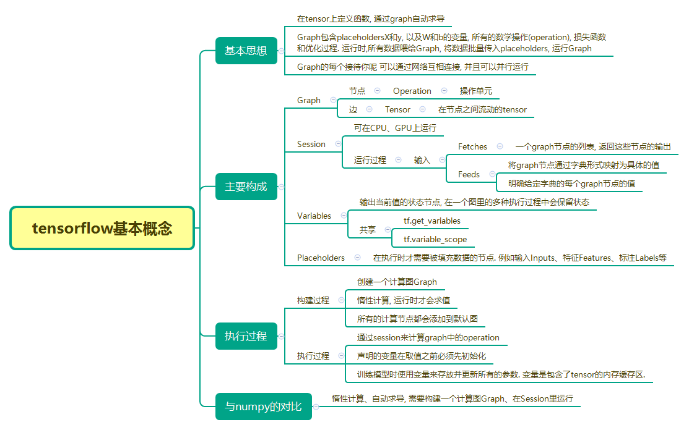
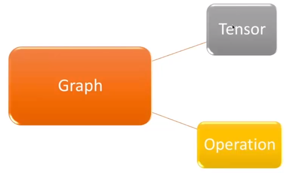
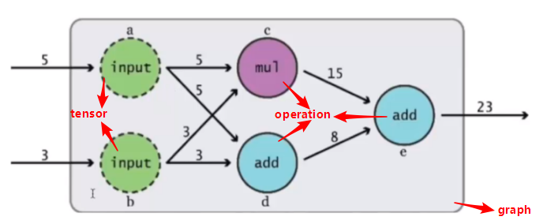

# tensorflow入门




- 深度学习的项目流程:

```python
数据预处理 --> 模型训练 --> 模型保存 --> 模型预测
```

- Tensorflow学习要点:

```python
数据类型
运行机制
数据的IO
模型的训练
模型保存
模型的调用
```

- 编写tensorflow的两个步骤:

```python
(1)构建计算图graph
(2)使用session去执行graph中的operation
```

- 重要概念

```python
# Tensor: 类型化的多维数组, 图的边
    - 实质: N维矩阵
    - 三个属性: rank, shape, data_type
    - 创建方法:
        import tensorflow as tf
        tf.zeros([row_dim, col_dim])
        tf.ones([row_dim, col_dim])
        tf.fill([row_dim, col_dim], 42)
        tf.constant([1, 2, 3])
        tf.random_uniform([row_dim, col_dim], minval=0, maxval=1)
        tf.random_normal([row_dim, col_dim], mean=0.0, stddev=1.0)


# Operation: 执行计算的单元, 图的节点
    - 实质:
        一个符号化的运算过程
        Graph中的计算节点
    - 特征:
        输入输出均为Tensor
    - 创建方法:
        tf.add(x, y)
    
# Graph: 一张有边与点的图, 其表示了需要进行计算的任务
    - 定义:
        Tensorflow中使用tf.Graph表示可计算的图. 图是由操作Operation和张量Tensor来构成, 其中Operation表示图的节点(即计算单元),而Tensor则表示图的边(即Operation之间流动的数据单元)
    - 创建方法:
        tf.Graph.__init__() 创建一个新的空Graph
# Session: 称之为会话的上下文, 用于执行图
```






```python
# 创建一个完整的计算过程需要三个步骤:
- 创建tensor
- 添加operations
- 执行计算(运行一个可计算的图)

# 以上图为例:
- a和b都是tensor,我们分别赋予它们5和3两个值
- c,d,e都是operation,c表示'乘',d和e表示'加'
- 图中整个计算过程构成了一个graph
- 最后我们把graph放到session中运行,输出结果
```


## 1.Tensorflow的高级API

- TF Learn(`tf.contrib.learn`): 类似于`scikit-learn`的接口
- TF SLIM: 一个可以定义, 训练, 和评估的复杂的模型的轻量库
- 其他: Keras等


## 2.Tensor

- tensor本质是一个N维矩阵.

- tensor的创建方法:

```python
import tensorflow as tf

tf.zeros([row_dim, col_dim])
tf.ones([row_dim, col_dim])
tf.fill([row_dim, col_dim], 42)
tf.constant([1, 2, 3])
tf.random_uniform([row_dim, col_dim], minval=0, maxval=1)
tf.random_normal([row_dim, col_dim], mean=0.0, stddev=1.0)
```

- tensor的属性:

```python
# Rank:
# rank一般是指数据的维度, 其与线性代数中rank不是一个概念.举例如下:

x1 = tf.constant(1.0, shape=[])			# rank=0, 标量
x2 = tf.constant(1.0, shape=[1])		# rank=1, 向量
x3 = tf.constant(1.0, shape=[1,1])		# rank=2, 矩阵
```

```python
# Shape:
# shape指tensor每个维度数据的个数,可以用python的list/tuple表示.
```

```python
# Data_type
# 是指单个数据的类型. 常用DT_FLOAT, 也就是32位的浮点数.
```


## 3.Operation

- 一个符号化的运算过程
- Graph中的计算节点
- 输入输出均为Tensor

```python
# 创建方法:

x = tf.constant(1, shape=[1, 2])
y = tf.constant(2, shape=[1, 2])
z = tf.add(x, y)
```


## 4.Graph

- 定义: Tensorflow中使用`tf.Graph`表示可计算的图. 图是由操作Operation和张量Tensor来构成的, 其中Operation表示图的节点(即计算单元), 而 Tensor则表示图的边(即Operation之间流动的数据单元)
- 创建方法: 
  - `tf.Graph.__init__()` 创建一个新的空Graph

```python
import tensorflow as tf

g1 = tf.Graph()
with g1.as_default():
    c1 = tf.constant([1.0])

with tf.Graph().as_default() as g2:
    c2 = tf.constant([1.0])
    
with tf.Session(graph=g1) as sess1:
    print(sess1.run(c1))
    
with tf.Session(graph=g2) as sess2:
    print(sess2.run(c2))
    
# result:
# [1.0]
# [2.0]
```


##  5.Session

- Session提供了Operation执行和Tensor求值的环境

```python
import tensorflow as tf

# 构建一个计算图
a = tf.constant([1.0, 2.0])
b = tf.constant([3.0, 4.0])
c = a * b

# 构建一个Session
sess = tf.Session()

# 把计算图放到session中, 并运行得到结果
print(sess.run(c))
sess.close()

# result:
# [3., 8.]
```

- 释放资源
  - 调用`session.close()`方法
  - 使用`with tf.Session()`创建上下文( context )来执行, 当上下文退出时自动释放

```python
import tensorflow as tf

# Build a graph
a = tf.constant([1.0, 2.0])
b = tf.constant([3.0, 4.0])
c = a* b

with tf.Session() as sess:
    print(sess.run(c))
```


## 6.Variables

- 作用: 保存并更新参数
- 特点: 
  - 使用之前必须对它进行初始化
  - 可以被共享

```python
# 在神经网络中,权重和偏置是经常要被用到的
# 我们使用Variable来保存它们

weights = tf.Variable(tf.random_normal([784, 200]), stddev=0.35, name='weights')
biases = tf.Variable(tf.zeros([200]), name='biases')
```

- Variables初始化
  - 初始化所有变量: `tf.global_variables_initializer`, 会在session运算时初始化所有变量
  - 初始化局部变量: `tf.variables_initializer`
    - 示例: `v1 = tf.variables_initializer([a, b], name='v1')`

- Variables和Constant的区别
  - Constant一般是常量, 可以被赋值给Variables, constant保存在graph中, 如果graph重复载入那么constant也会重复载入, 其非常浪费资源, 如非必要尽量不使用Constan保存大量数据
  - Variables在每个session中都是单独保存的, 甚至可以单独存放在一个参数服务器上

## 7.Placeholder与FeedDict

- placeholder: 可以使用`tf.placeholder(dtype, shape=None, name=None)`函数来定义

```python
x1 = tf.placeholder(tf.int32, shape=[1], name='x1')
x2 = tf.constant(2, name='x2')
result = x1 + x2
with tf.Session() as sess:
    print(sess.run(result, FeedDict={x1:[3]}))
```

