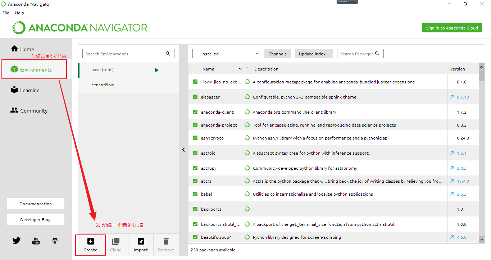
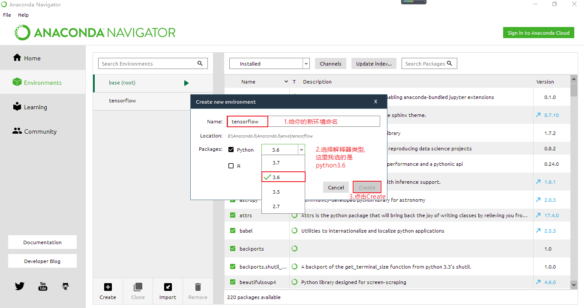
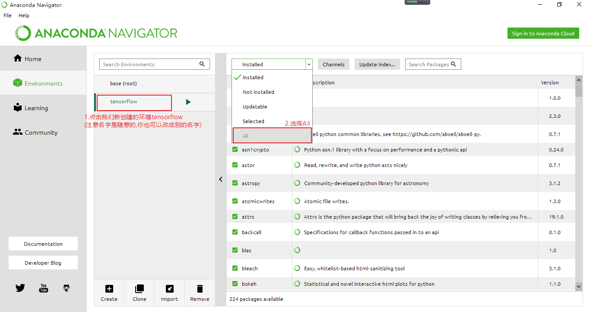
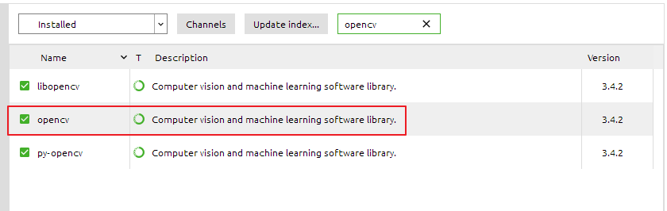
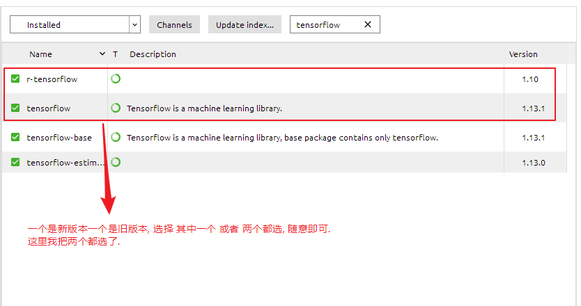
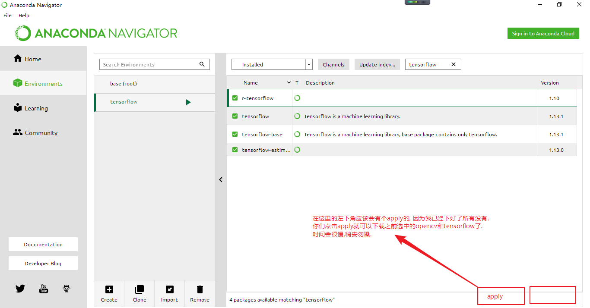
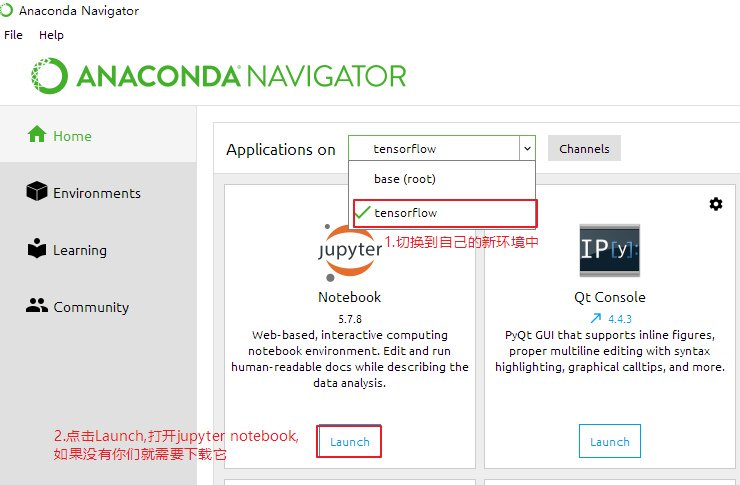
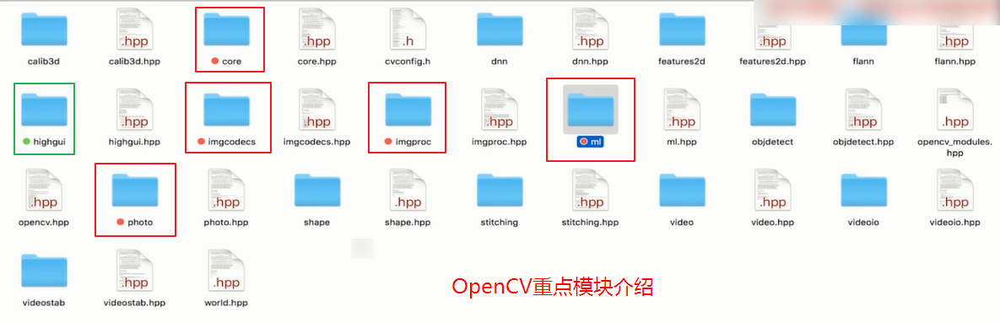

# 一.OpenCv环境搭建

- 官方社区: <https://www.opencv.rog/>
- github官方首页: <https://github.com/opencv/opencv>
- 参考资料1: [Python环境搭建之OpenCV](https://www.cnblogs.com/lely/p/9197985.html)  
- 参考资料2: [OpenCV 教程](http://www.opencv.org.cn/opencvdoc/2.3.2/html/doc/tutorials/tutorials.html)  
- 参考资料3: [opencv+python](https://www.cnblogs.com/lely/p/9197985.html)

## 1.Jupyter notebook环境安装

下载地址: <https://www.anaconda.com/distribution/>

安装步骤: https://www.cnblogs.com/li-li/p/10435898.html


## 2.配置opencv和tensorflow

1. 打开Anaconda Navigator



2. 创建新环境



3. 进入新环境



4. 找到我们要安装的包: 分别是opencv和tensorflow





5. 下载选中的包



6. 切换环境, 打开jupyter notebook



7. 在jupyter notebook上新建文件, 测试opencv

```python
'''
第一个测试脚本
'''

# 1. 导入cv模块
import cv2 as cv

# 2. 读取图像,支持 bmp, jpg, png, tiff 等常用格式
img = cv.imread('../sources/dog.jpg')

# 3. 创建窗口并显示图像
cv.namedWindow('Image', cv.WINDOW_AUTOSIZE) # 创建一个窗口,窗口名为'Image'
cv.imshow('Image', img) # 显示图像
cv.waitKey(0) # 不要关闭我创建的窗口,直到我手动关闭它

# 4. 释放(销毁)所有窗口,避免跨语言造成的不必要的内存泄露
cv.destroyAllWindows()
```


