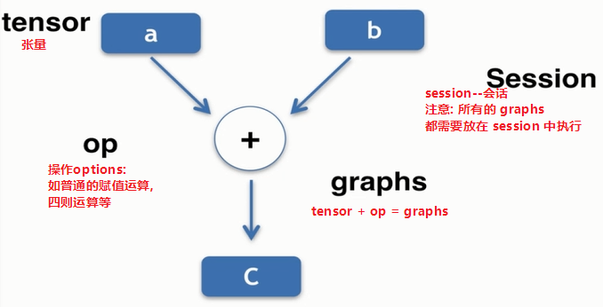

# 一.tensorflow常量和变量

```python
import tensorflow as tf
```

```python
data1 = tf.constant(2, dtype=tf.int32)	# 定义一个常量
data2 = tf.Variable(10, name='var')		# 定义一个变量
```

```python
print(data1) # dtype=int32
print(data2) # dtype=int32_ref

'''
输出结果:
Tensor("Const_3:0", shape=(), dtype=int32)
<tf.Variable 'var_3:0' shape=() dtype=int32_ref>
'''
```

```python
sess = tf.Session()
print(sess.run(data1))

'''
输出结果:
2
'''
```

```python
init = tf.global_variables_initializer()
sess.run(init)
print(sess.run(data2))

'''
输出结果:
10
'''
```

对比以上代码可以看出, 变量比常量多一步**初始化**的操作:

```
init = tf.global_variables_initializer()
sess.run(init)
```


# 二.tensorflow运算实质



```
tensorflow的本质: tf = tensor + 计算图
tensor的本质: 数据
op: 操作(赋值,四则运算)
graphs: 数据操作的过程
session: 所有的计算图都要放在session中来执行,所以我们也可以把session当作是tensorflow运算的交互环境
```

再强调一点: tensorflow中的**所有变量**都需要经过**初始化**以后才可以进行运算.

事实上, 每一次Session执行完毕以后都需要手动关闭它:

```python
import  tensorflow as tf
	
    ...
    
sess = tf.Session()	# 开启会话
	...
sess.close()		# 关闭会话
```

以上代码也可以写成这种形式:

```python
import  tensorflow as tf

	...

sess = tf.Session()
with sess:
    ...
```


# 三.tensorflow的四则运算

## 1.常量之间的四则运算

```python
import tensorflow as tf

# 创建tensor
data1 = tf.constant(6)	# 创建常量
data2 = tf.constant(2)	# 创建变量

# 创建op
dataAdd = tf.add(data1, data2)			# data1 + data2
dataSub = tf.subtract(data1, data2)		# data1 - data2
dataMul = tf.multiply(data1, data2)		# data1 * data2
dataDiv = tf.divide(data1, data2)		# data1 / data2

# 创建会话
with tf.Session() as sess:
	# 在会话中执行计算图graphs
    print(sess.ruun(dataAdd))
    print(sess.ruun(dataSub))
    print(sess.ruun(dataMul))
    print(sess.ruun(dataDiv))
print('end!')


'''执行结果:
8
4
12
3.0
end!
'''
```


## 2.常量与变量之间的四则运算

```python
import tensorflow as tf

# 创建tensor
data1 = tf.constant(6)
data2 = tf.Variable(2)

# 创建op
dataAdd = tf.add(data1, data2)
dataSub = tf.subtract(data1, data2)
dataMul = tf.multiply(data1, data2)
dataDiv = tf.divide(data1, data2)

# 初始化变量
init = tf.global_variables_initializer()

# 创建会话
with tf.Session() as sess:
    sess.run(init) # 初始化变量后的tf对象也要放在会话中执行
    print(sess.run(dataAdd))
    print(sess.run(dataSub))
    print(sess.run(dataMul))
    print(sess.run(dataDiv))
print('end!')


'''执行结果:
8
4
12
3.0
end!
'''
```


## 3.四则运算之`eval()`方法

```python
import tensorflow as tf

# 创建tensor
data1 = tf.constant(6)
data2 = tf.Variable(2)

# 创建op
dataAdd = tf.add(data1, data2) # data1 + data2
dataCopy = tf.assign(data2, dataAdd) # 这个op表示: 把dataAdd赋值给data2, 即data2 = data2 + data1
dataSub = tf.subtract(data1, data2) # data1 - data2
dataMul = tf.multiply(data1, data2) # data1 * data2
dataDiv = tf.divide(data1, data2) # data1 / data2

# 初始化变量
init = tf.global_variables_initializer()

# 创建会话
with tf.Session() as sess:
    sess.run(init)
    print(sess.run(dataAdd))
    print(sess.run(dataSub))
    print(sess.run(dataMul))
    print(sess.run(dataDiv))
    print('sess.run(dataCopy)', sess.run(dataCopy))
    print('dataCopy.eval()', dataCopy.eval())
    print('tf.get_default_session()', tf.get_default_session().run(dataCopy))
print('end!')

'''执行结果:
8
4
12
3.0
sess.run(dataCopy) 8
dataCopy.eval() 14
tf.get_default_session() 20
end!
'''
```

