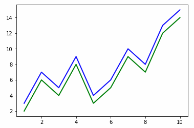
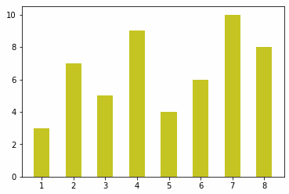

# 一.使用numpy对矩阵进行基本操作

```python
import numpy as np

# 1行5列
data1 = np.array([1, 2, 3, 4, 5])
# 2行3列
data2 = np.array([[1, 2, 3],
                  [4, 5, 6]])

# 查看矩阵的维度
print(data1.shape, data2.shape)

# 使用zeros和ones创建矩阵
print(np.zeros([2, 3]))
print(np.ones([2, 3]))

# 改, 查
data2[0,1] = 3 # 将data2中第0行第1列的值修改为7
print(data2)

# 基本运算
print(data2 + 2)
print(data2 - 2)
print(data2 * 2)
print(data2 / 2)

# 矩阵运算  注意,data2和data3的维度是完全相同的
data3 = np.ones([2, 3])
print(data2 + data3) # 相同位置的元素进行相加
print(data2 * data3) # 相同位置的元素进行相乘
```


# 二.使用matplotlib绘制图表

## 1.绘制折线图

```python
import numpy as np
import matplotlib.pyplot as plt # pyplot是matplotlib的一个绘图工具

# 绘制折形图
x = np.array([1, 2, 3, 4, 5, 6, 7, 8, 9, 10])
y1 = np.array([3, 7, 5, 9, 4, 6, 10, 8, 13, 15])
y2 = y1 - 1
plt.plot(x, y1, 'b', lw=2) # 1:x 2:y 3:color 4:线宽
plt.plot(x, y2, 'g', lw=2)
plt.show()
```



## 2.绘制柱状图

```python
import numpy as np
import matplotlib.pyplot as plt # pyplot是matplotlib的一个绘图工具

# 绘制饼状图
x = np.array([1, 2, 3, 4, 5, 6, 7, 8])
y = np.array([3, 7, 5, 9, 4, 6, 10, 8])
plt.bar(x, y, 0.5, alpha=0.9, color='y') # 1:x 2:y 3:宽度占比(0~1) 4:透明度(0~1) 5:颜色
plt.show()
```



## 3.绘制饼状图

略

